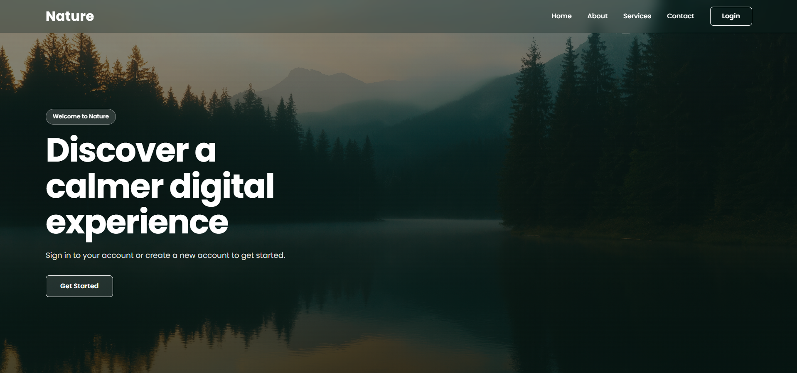
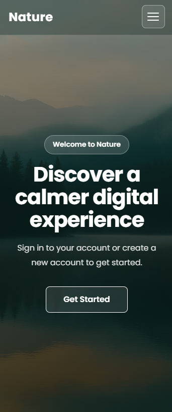
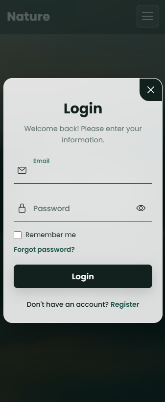
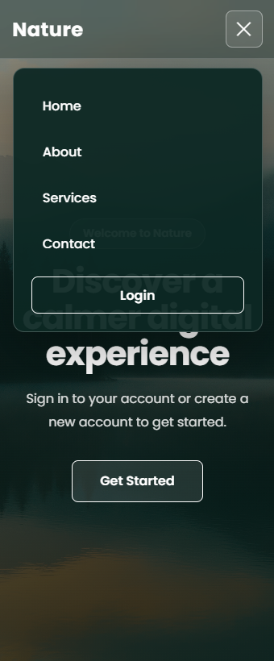

# Login

Kurze professionelle Projektbeschreibung.

## Funktionen

- Responsive Design
- Login- und Registrierungsformular
- Mobile Navigation
- Passwort ein- und ausblenden
- Formularwechsel mit Animationen

## Technologien

- HTML5
- CSS3
- JavaScript

## Live-Demo

[Projekt live ansehen](https://kinanashkar.github.io/Login/)

## Screenshots

### Desktop-Ansicht

### Mobile-Ansichten

  

  

  

